# 📂 Portfolio — Project Case Studies

> Detailed breakdowns of production work. For a quick overview, see the [README](README.md). For the resume, [download PDF](Abdul_Samad_Resume.pdf).

---

## 💼 Work Experience

### 🏢 AI-First Software Engineer II | Trilogy (Contractor - Remote)
**May 2025 - January 2026**

#### 📦 PROJECT 1: Khoros Platform Integration & CI/CD Standardization

`CI/CD` `DevOps` `backend` `UI` `multi-repo` `Python` `Java` `Node.js` `React` `Docker` `Jenkins` `CircleCI` `Maven` `Gradle` `AWS` `GCP`

📋 **Situation:**
Following Trilogy's acquisition of Khoros (global customer engagement platform), the engineering team inherited 375 repositories across 4 product lines (Care, Community, Marketing/Spredfast, Flow.AI) with inconsistent documentation, build procedures, and deployment standards. New engineers required 4 weeks to onboard, and deployment errors were frequent due to lack of standardized processes.

🎯 **Task:**
Lead the integration and standardization of 375 repositories into Trilogy's infrastructure, creating comprehensive documentation, establishing CI/CD workflows, and enabling the engineering team to work confidently across the entire platform.

⚡ **Actions:**
- Analyzed and documented 375 repositories spanning diverse technology stacks (Java/Maven backends, Node.js services, React frontends, Python automation)
- Standardized CI/CD pipelines using Jenkins and CircleCI for automated deployments across AWS and GCP
- Created comprehensive deployment runbooks for multi-environment setups (Dev → QA → Staging → Production)
- Validated testing infrastructure with Docker containerization and established consistent patterns
- Documented build procedures using Maven, Gradle, npm, and Webpack
- Established Git workflows and version control standards across all product lines

✅ **Result:**
- Reduced new engineer onboarding time from **4 weeks to 1 week**
- Reduced deployment errors by **60%** through consistent runbooks and automation
- Successfully standardized 375 repositories with comprehensive documentation
- Enabled Trilogy team to confidently work across entire platform
- Provided foundation for all future integration initiatives

🛠️ **Technologies:** Jenkins, CircleCI, Git, Maven, Gradle, npm, Docker, Python, Java, Node.js, React, AWS, GCP

---

#### 🗑️ PROJECT 2: Twitter Integration Removal — Multi-TB Data Purge

`data-engineering` `distributed-systems` `backend` `UI` `multi-region` `Python` `SQL` `CQL` `Bash` `React` `Angular` `MySQL` `Aurora` `Cassandra` `Elasticsearch` `AWS` `S3` `Boto3` `Selenium` `Jest`

📋 **Situation:**
Following Twitter's API policy changes, Khoros needed to completely remove Twitter integrations across 4 product lines. This included API decommissioning, UI cleanup across 100+ repositories, and safe deletion of multi-terabyte Twitter datasets from distributed production databases spanning multiple AWS regions.

🎯 **Task:**
Execute complete removal of Twitter integrations while maintaining 100% uptime, zero data loss for non-Twitter data, and ensuring no customer-facing disruptions across the global platform.

```mermaid
graph TD
    A["📋 Phase 1: Analysis & Discovery"] --> B["🛠️ Phase 2: Tool Development"]
    B --> C["🚀 Phase 3: Safe Deletion"]
    A -.- A1["9 MySQL DBs + 9 ES Clusters\n700M+ docs analyzed"]
    B -.- B1["12+ Python tools\nS3-backed safety + rollback"]
    C -.- C1["74M docs deleted\n100+ UI repos cleaned\nZero downtime"]
```

📊 **High-Level Summary:**
- **Analyzed:** 9 MySQL databases + 9 Elasticsearch clusters (700M+ documents, 355+ indices)
- **Discovered:** ~74M Twitter documents (17.9M streamitems + 56.1M calendar)
- **Built:** 12+ Python analysis & deletion tools with S3-backed safety architecture
- **Deleted:** Multi-terabyte datasets with chunked approach (53 phases total)
- **Achieved:** 100% uptime, zero service disruption, complete Twitter removal

<b>📋 Click to expand: Phase 1 - Analysis & Discovery</b>

⚡ **Actions:**
- **MySQL Analysis Suite:** Built comprehensive multi-database analysis toolkit analyzing **9 production MySQL databases** (qa22_oltp, qa22_ods, qa22_dataservice, qa22_finex, qa22_gateway, qa22_job, qa22_linktagging, qa22_quartz, qa22_session)
  - Developed intelligent table categorization by size (0, 1-10, 11-100, 101-500, 501-2K, 2K-10K, 10K-50K, 50K-100K, 100K+ rows)
  - Implemented adaptive sampling strategies optimizing query performance by **90%+** using CSV-based analysis
  - Created regex-powered Twitter detection across column names and row content with zero false positives
- **Elasticsearch Multi-Cluster Analysis:** Architected sophisticated discovery system analyzing **9 production Elasticsearch clusters** (3 streamitems, 3 calendar, 3 appsearch clusters) processing **700M+ documents** across **355+ indices**
  - Developed **4 distinct Twitter detection strategies:**
    1. Fast aggregation queries (service_name, channelForSort fields)
    2. Field name pattern analysis (twitter, tweet, retweet patterns)
    3. Content scanning (Twitter URLs, handles, API references)
    4. Intelligent sampling for massive indices (100K+ docs with clustering)
  - Discovered **~74M Twitter documents** (**17.9M** in streamitems + **56.1M** in calendar clusters)
  - Generated **30+ timestamped CSV analysis reports** for cross-cluster insights
  - Built interactive `run_twitter_analysis.py` orchestrator with menu-driven workflow

📊 **Phase Results:**
- Analyzed **9 MySQL databases** + **9 Elasticsearch clusters** (**700M+ total documents**)
- Discovered **~74M Twitter documents** requiring deletion
- Created **12+ Python analysis tools** with comprehensive reporting
- Established data inventory baseline for safe deletion planning

<b>🛠️ Click to expand: Phase 2 - Tool Development & Safety Architecture</b>

⚡ **Actions:**
- **API Decommissioning:** Identified and disabled all Twitter OAuth flows, API credentials, and authentication modules across Java backend services, Node.js microservices, and Python data pipelines
- **UI Cleanup:** Removed Twitter branding and functionality from **100+ repositories** (React, Angular, JavaScript/TypeScript) with comprehensive QA using Selenium and Jest
- **Chunked Deletion Architecture:** Engineered S3-backed chunked deletion system for safe removal:
  - Streamitems: **13 deletion phases** with individual chunk verification
  - Calendar: **40+ deletion phases** with S3 backup mapping
  - Implemented pre-deletion safety validators comparing live data against S3 backups
- **Safety Tooling:** Built comprehensive safety and rollback infrastructure:
  - `streamitems_chunked_deletion_tool.py` - Safe deletion with dry-run mode
  - `calendar_chunked_deletion_tool.py` - Proven chunked approach
  - `streamitems_chunked_safety_validator.py` - Pre-deletion verification
  - `twitter_deletion_safety_validator.py` - Multi-cluster validation
- **Documentation:** Created production-grade runbooks (TWITTER_DELETION_RUNBOOK.md, backup strategies, rollback procedures)

📊 **Phase Results:**
- Built **12+ production-grade Python tools** with safety-first architecture
- Established **S3-backed verification** for every deletion chunk
- Enabled **rollback capability** for emergency recovery
- Created **comprehensive runbooks** for production execution
- Cleaned **100+ UI repositories** with zero post-deployment issues

<b>🚀 Click to expand: Phase 3 - Safe Deletion Execution</b>

⚡ **Actions:**
- **MySQL/Aurora Deletion:** Executed batch deletion across **9 databases** using SQL DELETE statements with optimized batch processing to minimize lock contention
- **Cassandra Deletion:** Removed Twitter data from Cassandra keyspaces using CQL queries with tombstone management for distributed consistency
- **Elasticsearch Chunked Deletion:** Executed safe deletion of **~74M Twitter documents** using chunked approach:
  - **Streamitems clusters:** Deleted **17.9M documents** in 13 phases with S3 verification
  - **Calendar clusters:** Deleted **56.1M documents** in 40+ phases with incremental validation
  - Applied bulk API operations with index optimization for performance
- **Production Monitoring:** Monitored deletion progress using AWS CloudWatch metrics, Elasticsearch cluster health, and database performance metrics across 3 AWS regions (us-west-2, eu-west-1, ap-southeast-2)
- **Phased Rollout:** Coordinated with DBA and SRE teams for incremental production deployment with pause-and-validate strategy

📊 **Phase Results:**
- Successfully deleted **~74M Twitter documents** from Elasticsearch with **zero downtime**
- Removed Twitter data from **9 MySQL databases** and Cassandra clusters with **zero service disruption**
- Maintained **100% uptime** and **100% data integrity** for non-Twitter data throughout entire project
- Executed all deletions with **S3-backed verification** and **rollback readiness**

🏆 **Overall Project Results:**
- Successfully eliminated Twitter integrations across **4 product lines** (Care, Community, Spredfast, Flow.AI)
- Analyzed **700M+ documents** and safely deleted **~74M Twitter documents** from production
- Cleaned **100+ UI repositories** and decommissioned all Twitter API integrations
- Achieved **multi-terabyte data reduction** across MySQL, Cassandra, and Elasticsearch
- Maintained **100% platform uptime** with **zero customer-facing disruptions**
- Eliminated ongoing Twitter API costs and compliance overhead
- Built reusable **safety-first deletion framework** for future large-scale data purges

🛠️ **Technologies:** Python, MySQL/Aurora, Cassandra, Elasticsearch (1.x-7.x), AWS (S3, CloudWatch, multi-region), PyMySQL, Boto3, SQL, CQL, React, Angular, JavaScript, TypeScript, Selenium, Jest, CSV analytics, Bash

---

#### 💰 PROJECT 3: AWS Cost Optimization — $358K+ Annual Savings

`cost-optimization` `infrastructure` `cloud-architecture` `Python` `Bash` `AWS` `EC2` `EBS` `EMR` `ECS` `Athena` `CloudWatch` `Terraform` `Boto3` `Pandas` `Datadog` `Spark` `Cassandra` `Elasticsearch`

📋 **Situation:**
AWS infrastructure across 44 accounts and 3 regions (us-west-2, eu-west-1, ap-southeast-2) had accumulated significant waste through outdated instance types, oversized storage, and unused resources. Annual spend exceeded optimal levels by an estimated 30-50%.

🎯 **Task:**
Analyze infrastructure utilization patterns and implement data-driven optimization strategies to reduce AWS costs while maintaining or improving performance and availability.

```mermaid
graph TD
    A["🔍 44 AWS Accounts — 3 Regions"] --> EMR["💻 EMR Modernization\n-$220K/yr"]
    A --> LIA["💾 EBS Rightsizing\n-$122K/yr"]
    A --> NAT["🌐 NAT Gateway\n-$100K+ target"]
    A --> ELB["🧹 ELB Cleanup\n-$14K/yr"]
    EMR --> S["💰 $358K+ Annual Savings"]
    LIA --> S
    NAT --> S
    ELB --> S
```

📊 **High-Level Summary:**
- **Analyzed:** 44 AWS accounts across 3 regions (us-west-2, eu-west-1, ap-southeast-2)
- **Optimized:** 15 EMR clusters, 485 application servers, 7 Cassandra clusters, 90 ELBs
- **Built:** Python automation tools for CloudWatch, Datadog, Cost Explorer, and VPC Flow Logs analysis
- **Achieved:** $358K+ annual savings with zero service disruption

<b>💻 Click to expand: EMR Cluster Modernization ($220K/year)</b>

**Scope:** 15 EMR clusters across 2 Community Analytics accounts (519148787890, 052386936954)

⚡ **Actions:**
- Analyzed current state: 15 clusters using older generation instances (r5: 61.6%, m5: 31.5%) with $294K annual cost
- Built Python automation to analyze CloudWatch CPU/memory metrics and Spark workload patterns over 30-day periods
- Developed migration runbooks following LIA-852 pattern for zero-downtime instance group additions
- Migrated core nodes from 5th-gen (r5.4xlarge, m5.2xlarge) to 7th-gen AMD instances (r7a.4xlarge, m7a.2xlarge)
- Upgraded EBS volumes from GP2 to GP3 (3000 IOPS baseline, better cost/performance)
- Enabled EMR-managed scaling with minimum 2 nodes per core instance group
- Executed phased rollout: test clusters first (3 low-cost), then top 5 high-cost clusters ($84K), then remaining 10
- Validated YARN metrics, job completion times, and cluster health after each migration

✅ **Results:**
- **$220K annual savings** (50% reduction from $294K to $147K)
- Improved Spark job performance by **35%** through better instance architecture
- All 15 clusters migrated with **zero service disruption**
- Established auto-scaling reducing idle resource costs

<b>💾 Click to expand: LIA Storage Optimization ($122K/year)</b>

**Scope:** 485 LIA application servers across 3 regions in account 820054669588

⚡ **Actions:**
- Analyzed fleet-wide storage: 485 servers uniformly provisioned at 500GB regardless of actual usage
- Collected 30-day Datadog disk utilization metrics across all instances
- Discovered massive overprovisioning: 59% wasted capacity (142 TB free out of 239.8 TB provisioned)
- Calculated average utilization: 41.3% across entire fleet
- SSH'd to sample instances to understand storage content breakdown (logs, user content, app code, caches)
- Developed rightsizing matrix based on actual usage patterns:
  - 40-60GB usage → 150GB target (50 instances)
  - 60-100GB usage → 200GB target (150 instances)
  - 100-150GB usage → 250GB target (120 instances)
  - 150-200GB usage → 300GB target (80 instances)
- Created comprehensive Change Request with volume IDs, current/target sizes, and phased execution plan
- Executed volume modifications in 3 phases: high-impact first, then medium, then high-usage instances
- Monitored CloudWatch disk space metrics post-optimization (70% warn, 85% critical thresholds)

✅ **Results:**
- **$122K annual savings** (50% reduction from $245K to $122K)
- Reduced fleet storage from 239.8TB to ~122TB provisioned
- Maintained >100GB free space on all instances with **zero application issues**
- Established baseline standards: 200-250GB for new LIA hosts (vs previous 500GB default)

<b>🗄️ Click to expand: Cassandra Storage Optimization (Node Reduction Enabled)</b>

**Scope:** 7 self-managed Cassandra clusters (5 Marketing + 2 Communities Analytics)

⚡ **Actions:**
- Identified severe storage inefficiency in initial analysis: stream_items table with 10,017 SSTables causing 4.6x space amplification (8.5TB disk for 1.85TB live data)
- Built Python automation script with SSH connectivity to collect `nodetool cfstats` metrics from all 7 clusters
- Analyzed cluster-wide storage: discovered tables with >100GB waste threshold using inefficient Size-Tiered Compaction Strategy (STCS)
- Queried `system.schema_columnfamilies` via CQL to identify current compaction configurations
- Generated detailed analysis files for high-waste tables with AI-assisted compaction strategy recommendations
- Identified pattern: time-series tables with frequent writes/deletions required DateTieredCompactionStrategy (DTCS)
- Created Change Requests for DTCS migration on high-impact tables showing 5-16x storage bloat
- Coordinated with DBA teams for phased production rollout across Marketing and Communities clusters

✅ **Results:**
- Eliminated **5-16x storage bloat** across affected tables through DTCS compaction
- Enabled **node reduction** across 7 clusters by reclaiming wasted capacity
- Improved read performance by reducing excessive SSTable counts
- Built reusable analysis framework for ongoing Cassandra optimization

<b>🌐 Click to expand: NAT Gateway Optimization ($100K+ target)</b>

**Scope:** 3 accounts with $380K annual NAT Gateway costs (Care Production: $193K, Community Production: $79K, Care Development: $35K)

⚡ **Actions:**
- Identified optimization opportunity: $380K annual NAT Gateway costs across 3 accounts and multiple regions
- Enabled VPC Flow Logs on VPCs with high-cost NAT Gateways, configured S3 storage with Parquet format for optimal Athena performance
- Created Athena database and external table using AWS-provided VPC Flow Logs DDL templates
- Built Athena SQL queries to analyze traffic patterns: filtered NAT Gateway traffic, aggregated bytes by destination IP
- Fetched AWS service IP ranges from ip-ranges.amazonaws.com/ip-ranges.json
- Matched destination IPs to AWS services (S3, DynamoDB, ECR, ECS, CloudWatch) using Python automation
- Calculated data transfer volumes per service and extrapolated monthly/annual costs
- Architected phased VPC endpoint deployment strategy:
  - **Phase 1:** S3 and DynamoDB gateway endpoints (free, immediate deployment)
  - **Phase 2:** Interface endpoints for high-volume services (ECR, ECS, CloudWatch) where traffic >2TB/month justifies $22-67/month endpoint costs
- Created detailed Change Requests with expected savings, implementation steps, security group configurations, and rollback procedures
- Planned deployment order: Care Development first for validation, then production accounts

✅ **Results:**
- **$100K+ annual savings target** (30-50% reduction from $380K)
- Deployed gateway endpoints (S3, DynamoDB) with zero additional cost
- Identified high-ROI interface endpoints based on actual traffic analysis
- Built reusable VPC Flow Logs analysis framework with Athena queries

<b>🧹 Click to expand: Additional Cost Optimizations ($14K+ documented)</b>

### **Storage & Database Optimization**

**Cassandra Storage Optimization (7 clusters):**
- Analyzed 7 self-managed clusters (Marketing: 55 nodes across 5 clusters, Communities: 30 nodes across 2 clusters)
- Identified severe storage inefficiency: 4.6x space amplification (8.5TB disk for 1.85TB live data)
- Built Python automation with SSH connectivity to collect `nodetool cfstats` metrics across all clusters
- Analyzed >100GB waste threshold tables with inefficient Size-Tiered Compaction Strategy (STCS)
- Migrated bloated tables to DateTieredCompactionStrategy (DTCS) optimized for time-series data
- Example impact: audit_log table 5.88TB → 12.26GB (99.8% bloat reduction), stream_items 9,922 SSTables
- ✅ **Result:** Eliminated 5-16x storage bloat, enabled node reduction across all 7 clusters

**Marketing Cassandra Node Reduction:**
- Created automated Python analysis script for 5 Marketing Cassandra clusters
- Analyzed 30-day P99.5 CPU metrics via CloudWatch and NVMe storage utilization via SSH
- Generated 8 Change Requests (5 initial rounds + 3 Round2) for safe node removal
- Maintained thresholds: 80% CPU utilization, 45% storage (allowing 50% for compaction spikes)
- ✅ **Result:** Reduced EC2 node count while preserving cluster stability and performance

**Elasticsearch Indices Optimization:**
- Built comprehensive automation scripts for orphan detection, deleted doc expunge, and shard optimization
- Analyzed Community + Care self-managed Elasticsearch clusters across multiple regions
- Executed 9 milestones: 3 automation scripts + 6 cluster-specific implementations
- Orphan cleanup: removed indices from decommissioned customers
- Document expunge: forced merge for indices with >10% deleted documents
- Shard optimization: targeted 20-40GB per shard (AWS best practice)
- ✅ **Result:** Reduced storage costs, improved query performance across clusters

### **Compute & Container Optimization**

**ECS Cluster Optimization (6 clusters):**
- Analyzed 6 ECS clusters in Dev (3) and Prod (3+) environments across 2 accounts
- Evaluated CPU vs memory utilization ratios to determine r6a (memory-optimized) or t3a (burstable) migration
- Assessed bin packing efficiency and task co-location opportunities with 2xlarge instance sizing
- Performed EC2 vs Fargate cost comparison using Convertible RI 3yr and Compute Savings Plans analysis
- ✅ **Result:** Improved resource utilization, optimized instance type selections, documented Fargate ROI

**EA Community Node Reduction:**
- Analyzed 8-node c7a.8xlarge EA community cluster using P99 CPU metrics over 30-day period
- Created 3-wave phased reduction plan: 1 node per wave, 96 hours apart
- Generated Change Requests for node removal + rightsizing to c8a.4xlarge/c8a.8xlarge
- Maintained <80% CPU utilization threshold throughout reduction process
- ✅ **Result:** Reduced node count while preserving performance SLAs

### **Resource Cleanup**

**ELB Cleanup ($14,830/year):**
- Identified 90 unused ELBs (ALB, NLB, CLB) with zero requests over 60+ days using CloudFix
- Built Python/Boto3 automation to query target group health status across 2 accounts and 3 regions
- Categorized: Phase 1 (no healthy targets - immediate removal) vs Phase 2 (healthy targets - validation required)
- Created Change Requests: 44 ELBs in Care Production, 46 in Care Development
- ✅ **Result:** $14,830 annual savings, eliminated abandoned monitoring and application infrastructure

**EBS Snapshot Cleanup:**
- Built Python script to discover orphaned snapshots across 14 AWS accounts and multiple regions
- Applied criteria: not linked to AMI, not AWS Backup managed, not archived, not locked, older than 90 days
- Identified patterns: lia-ppod* snapshots from EC2 MySQL to RDS migrations
- Generated automated deletion Change Requests for all 14 accounts
- ✅ **Result:** Reduced snapshot storage costs, improved infrastructure hygiene

### **Investigation & Reliability Projects**

**Database-as-Queue Investigation:**
- Identified classic anti-pattern: 3 queue tables (subscription_delivery_queue, remote_event_retry_queue, tblia_gif_image_resize_queue)
- Analyzed INSERT/SELECT/DELETE polling pattern generating 3 database I/O operations per message
- Estimated 4.8M+ monthly I/O operations from queue polling overhead
- Evaluated SQS migration viability with cost-benefit analysis
- ✅ **Result:** Documented architectural anti-pattern, provided migration recommendations (Option 1: Batch Queries prioritized)

**Serverless Failover Investigation ($47K investigated):**
- Investigated 19 Aurora Serverless v2 failover instances for suspected connection pool misconfiguration
- Hypothesis: sql.pool.maxActive=100 too low, causing failovers to serverless readers
- Analyzed CloudWatch metrics, application logs, and RDS Performance Insights
- ✅ **Result:** Hypothesis rejected - traffic was deliberate reader endpoint usage by applications, not pool exhaustion issue

**Java Backend Profiling (EA Aurora):**
- Researched profiling options for JDK 8 Community backend services
- Evaluated tools: Datadog Java APM, JMX/VisualVM, async-profiler (recommended for JDK 8)
- Created Change Requests for Datadog Java APM integration + async-profiler deployment
- Target: EA Aurora backend (high-traffic environment) for maximum optimization impact
- ✅ **Result:** Established profiling capability to identify CPU hotspots, memory leaks, and JVM tuning opportunities

**Hardcoded ElastiCache Endpoints (AURORA-871):**
- Addressed production incident: hardcoded Redis endpoints caused outages when replicas removed
- Scanned repositories for hardcoded ElastiCache endpoints using automation scripts
- Replaced hardcoded values with SSM Parameter Store dynamic lookups
- ✅ **Result:** Prevented future outages, resolved eng-maintenance-16344 and AURORA-871 incidents

**Digest Queue Backlog Investigation:**
- Discovered 5.73M message backlog across 3 communities during database-as-queue analysis
- Breakdown: magento (815K remote_event_retry), eaaurora (4.86M digest notifications), xmnuz23762 (59K mixed)
- Root causes: failed remote integrations, digest service processing failures
- **Impact:** Identified critical operational issue affecting user notification delivery

**Search System Query Optimization:**
- Analyzed LIA search system generating 200-1000 database queries per search page
- Pattern: Elasticsearch returns message IDs only, then 10-50 DB queries per result for hydration
- Investigated optimization: Option 1 (Batch Queries - reduce to 5-10 queries), Option 2 (Redis caching), Option 3 (Elasticsearch denormalization)
- ✅ **Result:** Documented batch query optimization strategy as most feasible approach

🏆 **Overall Project Results:**
- Achieved **$358K+ annual savings** across 44 AWS accounts:
  - **$220K/year** (50%) from EMR modernization (15 clusters)
  - **$122K/year** (50%) from EBS rightsizing (485 servers)
  - **$14K/year** from ELB cleanup (90 load balancers)
  - **$100K+ target** from NAT Gateway optimization
- Improved Spark job performance by **35%** through better instance architecture
- Maintained **100% application performance** and **zero service disruption** across all transitions
- Built reusable Python automation framework integrating CloudWatch, Cost Explorer, Datadog API, VPC Flow Logs, and Athena
- Established data-driven optimization methodologies for ongoing cost management

🛠️ **Technologies:** AWS (EC2, EBS, EMR, ECS, ELB, VPC, NAT Gateway, CloudWatch, Cost Explorer, Athena, VPC Flow Logs), Python, Boto3, Pandas, Datadog, Spark, YARN, Terraform, Cassandra, Elasticsearch, Parquet, SSH/Paramiko, Bash

---

### 🏦 Software Developer | JPMorgan Chase & Co (Contractor - Remote)
**March 2023 - March 2025**

#### 🔄 PROJECT: Legacy Fintech Application Modernization

`legacy-modernization` `fintech` `event-driven` `backend` `C#` `.NET-8` `ASP.NET-Core` `Web-API` `WCF` `Python` `Apache-Kafka` `MessagePack` `SQL-Server` `PingFederate` `Azure-Entra-ID` `TeamCity` `OAuth-2.0` `JWT` `SSO` `RBAC`

📋 **Situation:**
JPMorgan Chase's PortfolioOne application (buy-side trading platform) was running on outdated .NET Framework 4.5.2 with WCF services, creating security vulnerabilities, performance bottlenecks, and maintenance challenges. The application served institutional traders requiring high availability and millisecond-level responsiveness.

🎯 **Task:**
Modernize 150+ backend services to .NET 8, migrate 45+ WCF services to Web API, implement enterprise SSO, and replace synchronous communication patterns with event-driven architecture—all while maintaining zero downtime for trading operations.

```mermaid
graph LR
    subgraph Before["🔴 .NET Framework 4.5.2"]
        WCF["WCF Services"]
        Sync["Synchronous Duplex"]
        Auth["Basic Auth"]
    end
    subgraph After["🟢 .NET 8"]
        API["Web API + MessagePack"]
        Kafka["Apache Kafka Events"]
        SSO["PingFederate + Entra ID"]
    end
    Before -->|"Python Automation — 150+ Services"| After
```

⚡ **Actions:**
- **Framework Upgrade:** Built custom Python automation tools to upgrade 150+ services from .NET Framework 4.5.2 to .NET 8, reducing manual effort by 80%
- **API Modernization:** Created Python automation scripts to convert 45+ WCF services to ASP.NET Web API with MessagePack serialization
- **Multi-Targeting Strategy:** Implemented multi-targeting projects enabling rollback capability for zero-risk deployments
- **Event-Driven Architecture:** Replaced WCF duplex communication with Apache Kafka for real-time notifications and market data feeds, handling high-volume institutional trading data
- **Async Conversion:** Converted blocking WCF synchronous calls to asynchronous operations, eliminating UI blocking and improving trader experience
- **Enterprise Security:** Integrated PingFederate and Azure Entra ID for SSO with RBAC, ensuring secure access for institutional users
- **CI/CD Pipeline:** Built and maintained TeamCity pipelines for multi-targeting .NET projects with comprehensive unit and regression testing

✅ **Result:**
- Successfully modernized **150+ backend services** to .NET 8
- Improved API performance by **58%** through MessagePack serialization
- Achieved **zero downtime** during migrations with rollback-safe architecture
- Enabled scalable event-driven architecture supporting high-volume trading data via Kafka
- Reduced UI latency during high-volume trading through async patterns
- Strengthened security posture with enterprise SSO and RBAC implementation

🛠️ **Technologies:** .NET 8, .NET Framework, C#, ASP.NET Core, Web API, WCF, Python, Apache Kafka, MessagePack, PingFederate, Azure Entra ID, TeamCity, SQL Server, OAuth 2.0, JWT, RBAC

---

### 📚 Senior Technical Content Engineer | Educative (Lahore, Pakistan)
**January 2022 - June 2023**

#### 🎓 PROJECT: Interactive Programming Platform & Cloud Labs

`content-platform` `cloud-labs` `backend` `UI` `Docker` `Kubernetes` `Python` `C#` `Java` `.NET` `Django` `Flask` `FastAPI` `React` `MongoDB` `Kafka` `DigitalOcean` `CI/CD` `MERN` `MEAN`

📋 **Situation:**
Educative, an interactive learning platform, needed to scale its content offerings with hands-on programming projects and browser-based development environments to support thousands of learners preparing for FAANG interviews and learning modern technology stacks.

🎯 **Task:**
Create top-selling interactive programming projects covering software engineering fundamentals and build Docker-based cloud labs enabling browser-based coding environments for 10+ technology stacks.

⚡ **Actions:**
- **Content Development:** Created 15+ top-selling interactive programming projects covering OOP/OOD, algorithms, and design patterns in C#, Java, Python, and C++
- **Lab Creation:** Designed hands-on labs for FAANG interview preparation including:
  - Streaming/message brokers (Kafka)
  - REST APIs and authentication/authorization
  - E-commerce microservices architecture
  - System design and scalability patterns
- **Infrastructure Dockerization:** Dockerized 10+ modern technology stacks for cloud lab platform:
  - MERN & MEAN Stack
  - .NET & ASP.NET Core
  - Django & Flask (Python)
  - MongoDB, PostgreSQL
  - Vue.js, React
- **Platform Enhancement:** Contributed to test automation and CI/CD pipeline improvements for content delivery infrastructure
- **CI/CD Automation:** Engineered user-friendly pipeline using Kubernetes and DigitalOcean for automated GitHub repo checkout, Docker image builds, and lab deployments

✅ **Result:**
- Created **15+ top-selling courses** adopted by thousands of learners
- Successfully Dockerized **10+ technology stacks** streamlining development workflows
- Enabled browser-based coding environments eliminating local setup complexity
- Contributed to platform growth with modernized features aligned with industry demands
- Built comprehensive FAANG interview preparation content for Kafka, APIs, microservices, and distributed systems

🛠️ **Technologies:** Docker, Kubernetes, Python, C#, Java, .NET, Django, Flask, FastAPI, React, MERN/MEAN Stack, MongoDB, Kafka, CI/CD, DigitalOcean, Git

---

### ⚡ Engineer | Tricon Boston Consulting (Jhimpir, Pakistan)
**December 2020 - January 2022**

#### 🌬️ PROJECT: Wind Turbine Performance Optimization & Predictive Maintenance

`IoT` `energy` `predictive-maintenance` `data-analysis` `simulation` `backend` `UI` `Python` `MATLAB` `.NET` `JavaScript`

📋 **Situation:**
Wind farm with 120 turbines in Pakistan's Jhimpir wind corridor needed to maximize electricity generation, minimize downtime, and optimize maintenance scheduling to improve operational efficiency and ROI.

🎯 **Task:**
Develop predictive maintenance models for early fault detection, analyze vortex generator impact on performance, and create real-time monitoring dashboard for government oversight.

⚡ **Actions:**
- **Predictive Modeling:** Built MATLAB and Python simulation models analyzing wind turbine conditions for early fault detection and maintenance scheduling
- **Performance Analysis:** Analyzed vortex generator impact on electricity generation using historical and predictive wind data models
- **Data Analysis:** Conducted data analysis on daily, monthly, and yearly intervals to uncover operational insights
- **Monitoring Dashboard:** Created real-time UI using .NET and JavaScript providing live generation updates for government monitoring, enabling data-driven operational decisions

✅ **Result:**
- Reduced wind turbine **downtime and maintenance costs** through early fault detection
- Optimized electricity generation through data-driven vortex generator recommendations
- Enabled efficient government monitoring with real-time generation updates
- Improved operational efficiency across **120 turbines**

🛠️ **Technologies:** Python, MATLAB, .NET, JavaScript, data analysis, simulation modeling, UI development

---

## 🚀 Independent Projects

### 🏦 AI-Assisted Bank Reconciliation System
**2025**

`AI` `LLM` `full-stack` `fintech` `automation` `backend` `UI` `Python` `FastAPI` `React` `Gemini` `LangChain` `Pinecone` `HuggingFace` `AWS` `Docker` `NGINX` `GitHub-Actions` `OCR`

📋 **Situation:**
Bookkeeping company managing trucking companies needed automated solution to process PDF bank statements from multiple banks, categorize transactions, and export reconciled data—a process taking hours of manual work per client.

🎯 **Task:**
Build AI-powered bank reconciliation tool automating PDF ingestion, OCR extraction, intelligent transaction categorization, and CSV/Excel export generation.

```mermaid
graph LR
    PDF["📄 PDF Statements"] --> OCR["OCR Extraction"]
    OCR --> LLM["🤖 Gemini + LangChain"]
    GL["📋 GL / Chart of Accounts"] --> Vec["Pinecone + HuggingFace"]
    Vec --> LLM
    LLM --> Cat["Transaction Categorization"]
    Cat --> Export["📊 CSV / Excel"]
```

⚡ **Actions:**
- **Document Processing:** Built PDF ingestion system with OCR extraction for multiple bank statement formats
- **AI Categorization:** Implemented transaction categorization using Gemini LLM with LangChain framework
- **Vector Search:** Integrated Pinecone vector database with HuggingFace embeddings for client-specific GL/Chart of Accounts context
- **Full-Stack Development:** Delivered complete workflow with FastAPI backend and React frontend
- **Performance Optimization:** Implemented async batching with concurrency limits, structured logging, health endpoints, and CSV-safe sanitization
- **Production Deployment:** Deployed on AWS using Docker (pre-downloaded embedding models), NGINX reverse proxy (CORS + timeout handling), CloudWatch logging, and GitHub Actions CI/CD

✅ **Result:**
- Automated hours of manual reconciliation work per client
- Enabled accurate transaction categorization using client-specific accounting context
- Delivered production-ready system with comprehensive logging and monitoring
- Reduced cold starts through optimized Docker image with embedded models

🛠️ **Technologies:** Python, FastAPI, React, Gemini LLM, LangChain, Pinecone, HuggingFace, AWS, Docker, NGINX, CloudWatch, GitHub Actions, OCR

---

### 🚛 IFTA DriverPacket Processing System
**2025**

`AI` `OCR` `GIS` `automation` `compliance` `backend` `Python` `FastAPI` `Gemini` `HERE-Maps` `AWS` `S3` `Docker` `GitHub-Actions` `EC2`

📋 **Situation:**
Trucking companies needed to convert driver packet images and route CSVs into structured IFTA reports for state-by-state fuel tax compliance—a manual, error-prone process taking days per filing.

🎯 **Task:**
Build AI-powered pipeline automating driver packet OCR, route processing, GIS-based mileage calculation, and jurisdiction-ready IFTA export generation.

```mermaid
graph LR
    Img["📸 Driver Packets"] --> OCR["Gemini OCR"]
    CSV["📄 Route CSVs"] --> HERE["HERE Maps API"]
    OCR --> Proc["Data Processing"]
    HERE --> GIS["GIS State Mileage"]
    Proc --> Gen["IFTA Report Generator"]
    GIS --> Gen
    Gen --> CA["CA CDTFA-5235"]
    Gen --> TX["TX X12 813"]
```

⚡ **Actions:**
- **Document Intelligence:** Implemented driver packet image processing using Gemini OCR for data extraction
- **Route Processing:** Integrated HERE Maps routing and geocoding APIs for accurate trip reconstruction
- **GIS Analysis:** Built GIS-based state-by-state mileage calculation with jurisdiction boundary detection
- **API Development:** Implemented FastAPI backend with endpoints for:
  - Miles calculation and route processing
  - Driver packet OCR and data extraction
  - PCS trip processing
  - IFTA exports (CA CDTFA-5235, TX X12 813 formats)
- **Storage & Security:** Integrated AWS S3 for document storage with pre-signed download URLs
- **Production Deployment:** Productionized with Docker, GitHub Actions CI (tests/lint/security), automated EC2 deployment

✅ **Result:**
- Automated multi-day manual IFTA filing process to minutes
- Eliminated human errors in mileage calculation and state jurisdiction determination
- Generated jurisdiction-ready exports for California and Texas IFTA filing
- Delivered production-ready system with comprehensive testing and security scanning

🛠️ **Technologies:** Python, FastAPI, Gemini OCR, HERE Maps API, GIS, AWS S3, Docker, GitHub Actions, EC2, geocoding, routing APIs

---

🔒 *Enterprise projects describe architecture, patterns, and outcomes — not proprietary code. Independent projects have full source on GitHub.*

*Last updated: February 2026*
